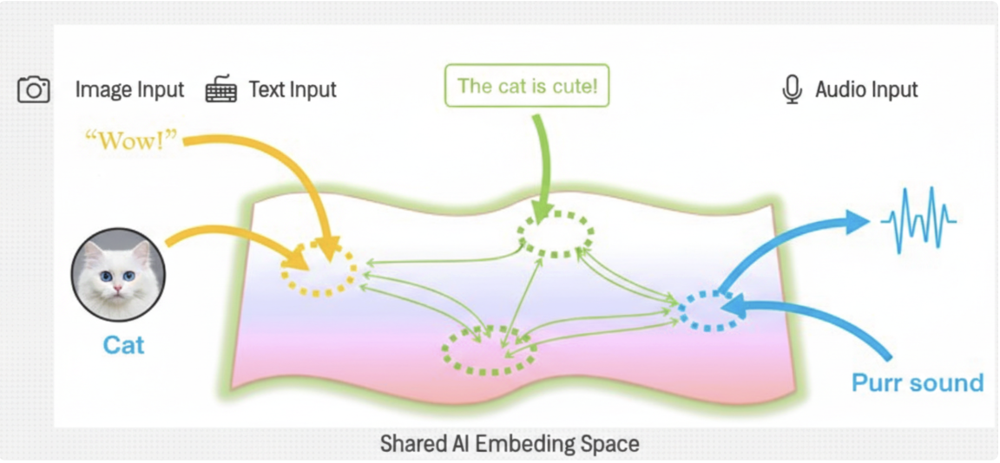
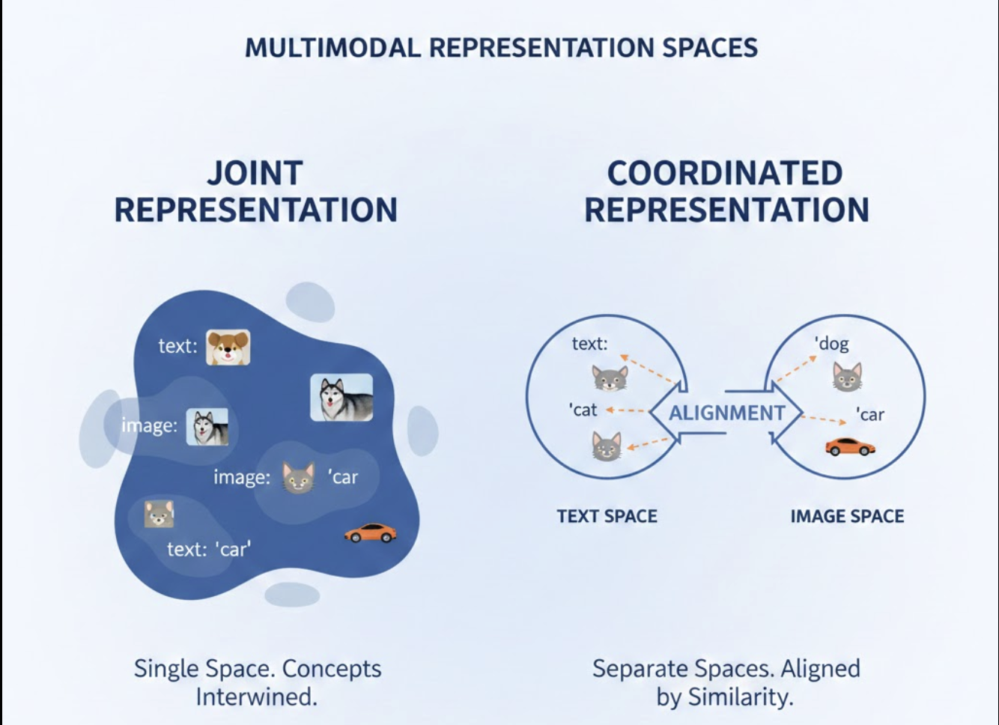
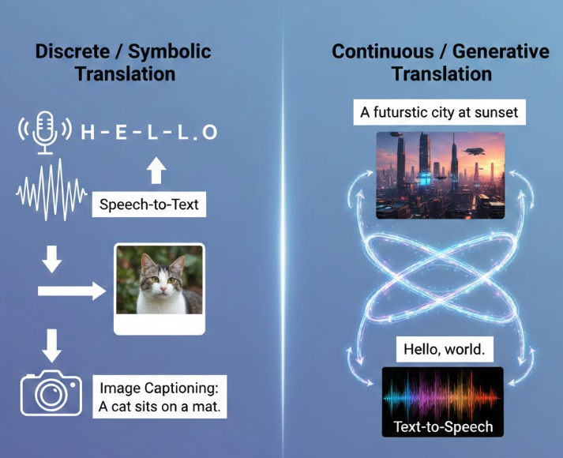
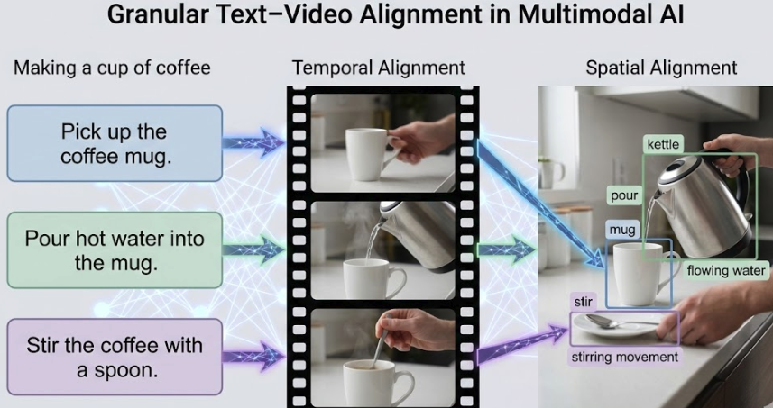
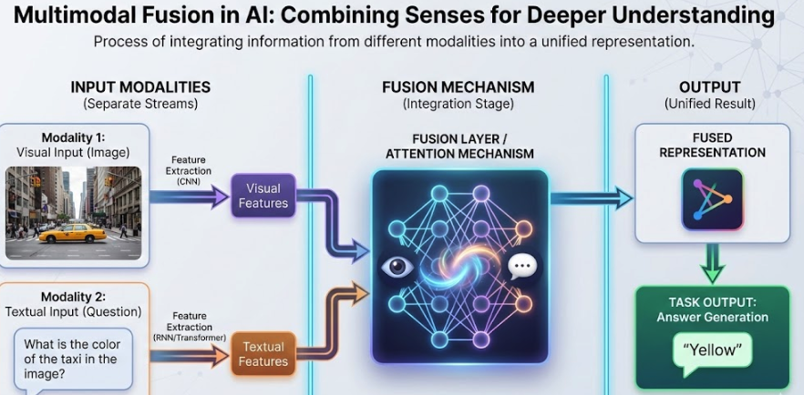
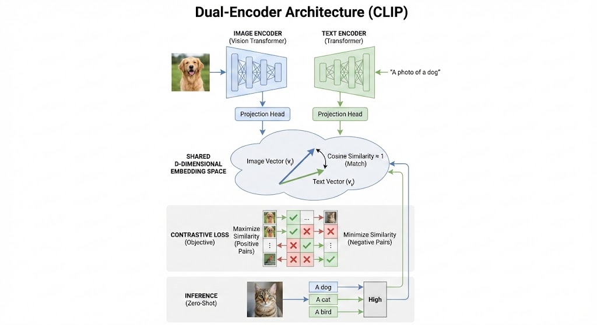
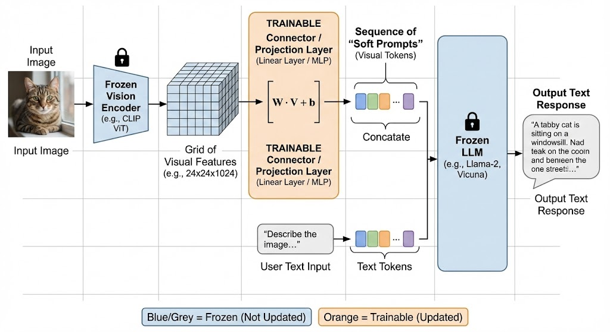
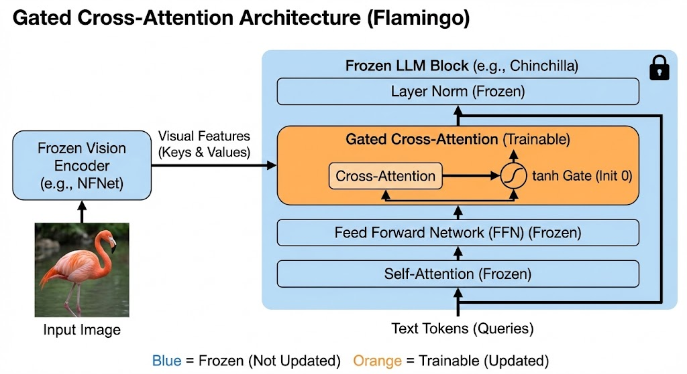
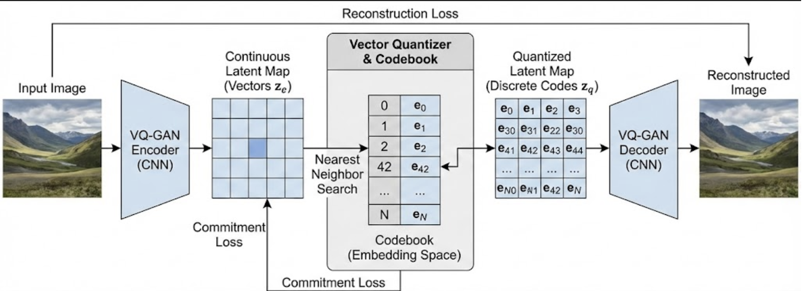
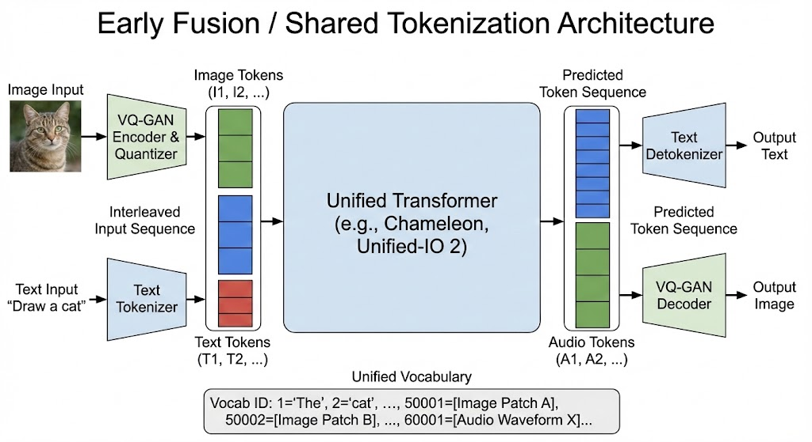

Multimodals are the systems that can process, understand, and generate content across multiple types of data (modalities) simultaneously. Humans are naturally multimodal. When you watch a movie, you simultaneously process:

- Visual Information (scenes, faces, objects)
- Audio Information ( music, dialogue, sound effects)
- Text Information (Captions, credits)
- Temporal Information ( the story unfolds over time)

The Human brain doesn't process these separately, It fuses them into a unified understanding. Multimodal AI tries to do the same.

---

## The Modality Spectrum



Modalities are not equal, each modality has different information density (pic is worth 1000 words), processing cost (Video >> Image >> Audio >> text), noise levels (speech in noisy room vs clean text), Alignment difficulty (Matching audio to the right video frame).

---

## The Five Core Challenges

The technical progression of MMML is categorized into five core challenges:

1. **Representation:** To learn meaningful features from each modality separately. How to encode each modality?
2. **Translation:** To map data from one modality to another. How do we transform between modalities? Image --> Caption, etc.
3. **Alignment:** To identify matching elements across modalities. Which word corresponds to which region in an image?
4. **Fusion:** To merge multiple modalities into single representation. (Early Fusion, Late Fusion, Hybrid/Attention fusion)
5. **Co-learning:** To transfer knowledge across modalities.

---

## 1. Representation

Representation is about transforming raw sensory data into structured numerical embeddings that machines can understand and reason over. Every modality has completely different statistical properties and the challenge is to encode them into meaningful vector space.

Representation is essentially a learned function like z = f(x) where x is raw modality and z is latent embedding and f acts as any encoder. Each modality has its own encoder.

- **Text:** Transformer Encoder
- **Audio:** Spectrogram + RNN/Transformer
- **Image:** CNN/ Vision Transformer

The representation of multi modal can be done in 2 types:

### Joint Representation

In the joint representation, all the modalities are projected into one embedding space. We want all the semantically similar concept to lie close together.

E.g. "dog" in a text vector should be close to dog image vector.

### Coordinate representation

In this representation, each modalities keeps their own space and later alignment connects them. This mostly done using contrastive losses, similarity objectives.

---

## 2. Translation

Translation is about mapping information across modalities. It is the process of transforming a representation from one modality to another, yet semantically equivalent, representation in another modality. Translation serves as a generative tasks where one model serve as a source and another as the target.



The translation has to be:

- **Asymmetry:** This process is often unidirectional. A model trained for text to image (like DALL-E) requires different architecture than one for image-to-text (Image Captioning).
- **Entity Aligned:** The model must learn that a specific entity in the source (the word "golden retriever") corresponds to specific features in the target (golden fur, floppy ears).
- **Many-to-many mapped:** Translation is rarely 1:1. A single sentence can be represented by infinite visual variations and a single image can be described by many different valid sentences.

There are two primary types of Translation:

### Discrete Translation

This involves mapping continuous or complex data into structured, symbolic tokens (or vice-versa).

- **Speech-to-text:** Mapping raw audio waveforms into discrete linguistic tokens (text).
- **Image Captioning:** Analyzing visual spatial features to generate a sequential string of words.

### Continuous/Generative Translation

This involves creating high-dimensional, dense data from symbolic or structured input.

- **Text-to-image generation:** Mapping a text prompt into a high dimensional pixel space using models like Diffusion or GANs.
- **Text-to-speech:** Mapping text characters into a mel-spectrogram or raw audio waveform, capturing prosody and tone.


---

## 3. Alignment

While Representation focuses on the "what" (features) and Translation on the "how" (mapping), Alignment is about the "where" specifically, which part of one modality corresponds to which part of another. It is the granular synchronization of data streams to ensure the model isn't jsut seeing a "dog" and the word "dog," but specifically matching the pixels of the ears to the concept of hearing or the audio of a bark.

A model has to measure all the similarities between different modalities and has to deal with long range dependencies.



Modalities alignment are of two types:

### Explicit Alignment

In explicit alignment, the goal is to find a direct, verifiable match between sub-segments of two modalities. This is often a preprocessing or a structural requirement.

- **Temporal Alignment:** Synchronizing audio features with specific text tokens (e.g. dynamic time warping in speech-to-text).
- **Spatial Alignment:** Mapping a bounding box in an image to a specific word in a sentence. (e.g. A "red car" aligns exactly with coordinates[x,y,w,h])
- **Use Cases:** Deepfake detection where lip movements must align perfectly with phonetic sounds.

### Implicit Alignment

This is the modern approach used in transformers. The model isn't forced to align data instead, it learns to attend to relevant parts of one modality based on the context of another.

- **Cross-Modal Attention:** While generating a caption, the model "looks" at specific patches of an image. When it generates the word "tree," its internal attention weights spike for the green, vertical pixels.
- **Visual Question Answering (VQA):** To answer "What color is the boy's hat?", the model aligns the word "hat" in the text query with the specific region of the image containing a hat.
- **Use Cases:** Midjourney or DALL-E, where the model aligns adjectives (e.g., "cyberpunk") with specific stylistic textures across the entire canvas.



### Alignment challenges

| Challenge    | Description                                                                               |
| ------------ | ----------------------------------------------------------------------------------------- |
| Ambiguity    | One word (e.g., "bank") might align with a river or a building depending on the visual.   |
| Granularity  | Deciding if a word should align with a single pixel, a patch, or the whole image.         |
| Missing Data | Aligning a transcript to a video where the speaker goes off-camera (non-existent visual). |

---

## 4. Fusion

In the multimodal systems, Fusion is the ultimate "decision-making" step. It is the act of merging the signals to reach a single conclusion (e.g. "this video shows a happy girl"). The timing of merger, when you combine the modalities determines the model's complexity and performance.



There are three types of fusion in multimodal AI

### Early Fusion (Feature-level)

Early fusion combines raw or pre-processed features into a single high-dimensional vector before passing them through the main model.

Modalities A and B are concatenated or summed immediately at the input layer which captures low-level correlations between modalities.

It is highly sensitive to "modality imbalance". If one modality is noisier or has a higher dimensionality, it can easily overwhelm the other.

### Late Fusion (Decision-level)

In Late Fusion, each modality is processed by its own independent model. Only the predictions (scores or probabilities) are combined at the very end.

Model 1 says "Cat (80%)" based on the image. Model 2 says "Cat (90%)" based on the audio. A final "Aggregator" (like an average or a vote) makes the call.

It is Robust so if one sensor fails, the other models can still provide a valid prediction but it completely misses "cross-moda" interaction. It treats modalities as independent silos until the last second.

### Intermediate / Hybrid Fusion

This is the most common approach in modern architectures (like Transformers). Fusion happens at multiple layers throughout the network.

Deep features from an image CNN and a text BERT are merged in the middle layers, allowing the model to learn complex, high-level interactions.

Best of both worlds: It captures interactions while maintaining modality-specific processing.

| Strategy     | When?         | Complexity             | Interaction Level  |
| ------------ | ------------- | ---------------------- | ------------------ |
| Early        | Input Layer   | Low                    | High (Low-level)   |
| Late         | Output Layer  | High (Multiple Models) | Zero (Independent) |
| Intermediate | Hidden Layers | Highest                | High (Semantic)    |

---

## 5. Co-learning

In multimodal learning, Co-learning is the most advanced and "intelligent" stage. It is the process of using information from a resource-rich modality (like Text) to improve a model's performance on a resource-poor modality (like Video or Infrared). Unlike Fusion or Alignment, Co-learning doesn't necessarily require both modalities to be present at the time of inference. It's about knowledge transfer.

### Zero-shot Learning (ZSL)

This is the "Golden Standard" of co-learning. The model learns a semantic relationship in text that it can then apply to a visual input it has never seen before. You train a model on "Striped" + "Horse" = "Zebra" using text descriptions. When shown an image of a Zebra for the first time, the model recognizes the "Striped" and "Horse" visual features and correctly labels it "Zebra." It highly relies on a shared semantic attribute space.

### Transfer Learning & Multi-tasking

Knowledge from one modality helps regularize or "teach" the other.

- **Cross-modal Transfer:** Pre-training a model on a massive text corpus (like Wikipedia) gives it a structural understanding of the world. When you later train it on images, it already "knows" that "apples" are "fruit" and "red," making the visual learning process much faster.
- **Co-training:** Using a small amount of labeled data in one modality to "label" the unlabeled data in another modality. If a video has a clear audio track of someone saying "I am cooking," the model can use that audio to label the visual pixels as "cooking" for future training.

### Conceptual Grounding

This is where the model uses one modality to resolve ambiguities in another.

Example: In text, "crane" could be a bird or a construction machine. By co-learning with images, the model learns the distinct visual contexts of both, which improves its internal text-only embeddings.

---

## Architecture

How Multimodal Models work? Modern Architectures have evolved through four primary paradigms to bridge the "semantic gap" between modalities:

### 1. Dual-Encoder Models (e.g. CLIP, CLAP)

This architecture is often referred to as a "Two-Tower" model. These use separate encoders for each modality (e.g., a Vision Transformer for images and a standard Transformer for text). The encoders project inputs into a shared D-dimensional embedding space where semantic similarity can be measured directly via cosine similarity. A Dual Encoder keeps the modalities separate until the very last step.

Lets take CLIP as an example and understand this Architecture: Clip (Contrastive Language-Image Pre-Training) is the most famous example of a Dual-Encoder model, developed by OpenAI (2021). It consists of two encoder.

**Encoder 1 ( Image Encoder )** - This is usually a ViT (Vision Transformer). You feed it an image (e.g. A photo of a dog) and it outputs a vector of numbers (an embedding).

**Encoder 2 ( Text Encoder )** - This is a standard Text Transformer (like a mini-GPT). You feed it text (e.g. "A photo of a dog") and it outputs a vector of numbers.

In CLIP both are trained to output vectors of the exact same size (e.g. 512 dimension) that live in the same geometric space.

#### The Training

To train these encoders, CLIP doesn't use manual labels like "Dog" or "Cat". Instead, it scrapes the internet for 400 million (images, Text) pairs.

It uses a technique called Contrastive Learning. Imagine a batch of N image-text pairs. The model constructs an N x N matrix of similarities.

- The diagonal elements (where image i matches text j) are correct answers. The model tries to maximize these values and tries to make them 1.
- The off-diagonal elements (where image i is paired with text j) are incorrect pair. The model tries to minimize these values (make them 0).

This forces the model to learn semantic feature rather than exact pixel matching. It learns that the visual pattern "fur and whiskers" corresponds to the text "cat".



#### Benefit of dual-encoder

- **Inference Speed:** Because the encoders are separate, you can precalculate the embeddings. For a search engine, you can encode 1 million images into vectors and store them. When a user types a query, you only encode the text once and do a fast vector search (dot product). You don't need to re-feed images through the neural network.
- **Zero-shot Capabilities:** Because the model learns the relationship between concepts and images generally, it can classify images it has never seen before, provided you can describe the category in text.

### 2. Connector/ Projection Layers (e.g. LLaVa, MiniGPT-4)

This architecture represents the current state-of-the-art in "Large multimodal Models". These models connect a pre-trained, frozen vision encoder to a pre-trained LLM using a lightweight projector (a linear layer of MLP). This projector transforms visual features into "soft prompts" that the LLM processes as if they were text tokens. If Clip is about matching images to text, models like LLaVa is about chatting about images.



Here is the breakdown of how Connector/Projection layers function as the "universal adapter" between vision and language.

#### The Core problem: Different Languages

You have two powerful, pre-trained brains:

- The Visual Encoder (e.g CLIP-ViT): It understands images perfectly but outputs a matrix of abstract numbers (visual features)
- The LLM (e.g Llama): It understands reasoning and text perfectly, but it only accepts text embeddings.

You cannot just plug the visual features into the LLM because the dimensions don't match, and the meaning of the numbers is different. The LLM except vectors that represent words not pixels.

#### Solution: The Projector (Translator)

It is the lightweight neural network placed between the Vision Encoder and the LLM. Its job is to mathematically transform the visual features so they look like text embeddings to the LLM.

```
VISUAL FEATURES ------> PROJECTION LAYER -----> VISUAL EMBEDDINGS (same dimension needed for text llm)
```

#### Soft Prompts

This is the most critical part to understand. When you type the word "Dog" into ChatGPT, it looks up the vector for "Dog" in its dictionary. This is "Hard Prompt" (discrete token). In LLaVA, the projector outputs vectors that do not correspond to any specific word in the dictionary. They are continuous vectors that exist in the LLM's embedding space. We call these "Soft Prompts" or "Visual Tokens".

The input sequence to the LLM looks like below. The LLM attends to these visual tokens exactly the same way it attends to past text conversation.

```
[Visual token 1] [Visual token 2][Visual token 3].......[Visual token 256] + "Describe what you see in the image"
```

In most of these architectures, we keep the Vision Encoder and LLM weights frozen. We only train the projector.

| Component      | Role                                            | Analogy                                          |
| -------------- | ----------------------------------------------- | ------------------------------------------------ |
| Vision Encoder | Extracts features from pixels.                  | The Eye (sees raw data).                         |
| Projector      | Transforms visual features into "soft prompts." | The Translator (converts "sight" to "language"). |
| LLM            | Processes the soft prompts + user text.         | The Brain (reasons and generates response).      |

### 3. Cross-Attention Mechanism (e.g. Flamingo)

Interleaves gated cross-attention layers with the pre-trained blocks of an LLM. This allows text tokens to attend to visual tokens at regular intervals, enabling the model to ingest interleaved sequences of images and text. This architecture, famously pioneered by DeepMind's Flamingo, represents a more sophisticated and computationally intensive way to fuse vision and language. While Connector models (like LLaVA) just "paste" the image at the beginning of the text prompt, Cross-Attention models allow the LLM to constantly "glance" at the image while it is thinking, deep inside its own neural network layers.



#### Deep Fusion

Instead of shoving the image in at the front door, we inject visual informaion into every layers of the LLM.

- The text flows through the LLM as usual.
- The image features exist in a separate "side memory".
- At Specific intervals, the LLM pauses its text processing to "attend" at that side memory.

#### The Dense Cross-Attention Mechanism

- **Queries (Q):** Come form the language tokens (the text the model is currently processing). The text is asking: "Relevant to what I'm reading right now, what's in the image?"
- **Keys (K) and Values (V):** Come from the Vision Encoder. The Image holds the answers.

Step1: The model processes a text token.

Step 2: It hits a Cross-attention later. The text token queries the image features.

Step 3: I extracts relevant visual context and mixes it into the text representation.

Step 4: It moves to the next layer.

#### Gating

You cannot just dum visual data into a pre-trained LLM without breaking it. The LLM is finely tuned for text so adding random image noise will destroy the language abilities. Hence, you use Gating as solution.

```
Output = Original_Text + tanh(alpha) x Cross_attention(text, image)
```

At Initialization: Since alpha=0, the tanh gate is 0. The Cross-Attention result is multiplied by 0. The model effectively ignores the image entirely and behaves exactly like the original, frozen LLM.

During Training: The model slowly learns to increase alpha, gradually letting in more and more visual information as it learns how to use it. This prevents "catastrophic forgetting" of language skills.

Because the Cross-Attention layers are separated from text stream, this architecture can handle complex sequences like:

```
[Text] --> [Image 1] --> [Text] --> [Image 2] ---> [Text]
```

It uses Masking to ensure that text tokens only attend to the images that appeared before them. So text following image 1 attends only to image 1 and text following image 2 will attend to both image 1 and image 2. This allows Flamingo to perform in-context learning.

### 4. Early Fusion / Shared tokenization (e.g. Chameleon, unified-IO 2)

This approach, often called "Native Multimodality" or "Early Fusion," represents the most radical and unified way to build an AI model. If CLIP is a "Translator" and Flamingo is a "Manager with a Side-Memory," models like Chameleon (Meta) and Unified-IO 2 are true "Polyglots." They don't translate images into text; they treat images as text.

Here is the breakdown of this "Everything is a Token" architecture.

#### One Vocabulary for everything

In Early Fusion models, we expand the vocabulary to include image tokens. The model does not distinguish between modalities. To the Transformer, an image is just a paragraph of "foreign words" (image tokens) that it learns to predict just like English words.

```
Token1 : "The", Token2: "cat", ......., Token 1002: [A specific patch of blue texture], Token 1003: [A specific curve shape]
```

#### Mechanism: VQ-GAN (The Tokenizer)

Since a transformer cannot process raw pixels (0-255), we must convert the image into discrete integers (tokens). We use a VQ-GAN (Vector Quantized Generative Adversarial Network) for this.

- **Input:** An image (e.g., 256 x 256 pixels).
- **Encoder:** Compresses the image into a grid of vectors.
- **Quantization (The Magic Step):** Each vector is "snapped" to the nearest neighbor in a fixed "codebook" of visual patterns.
- **Analogy:** Imagine painting a picture but you are only allowed to use a paint-by-numbers kit with 8,000 specific colors/shapes.
- **Result:** The image becomes a sequence of integers: [812, 45, 9901, ...]



#### Single Stream Transformer

Once the image is tokenized, the architecture becomes deceptively simple. It looks almost exactly like a standard text-only LLM.

```
Input Seq: [Start] "Draw a cat" [Img_token1] [Img_token2] ..... [Img_token1024][END]
```

Now the transformer attends to all the tokens equally. Text tokens attend to image tokens, and image tokens attend to text tokens. There are no separate encoders, no projection layers and no cross-attention gates.



#### Generation

This is the biggest advantage of Early Fusion over others.

LlaVa/Flamingo can see images but can only speak text. (They can't generate images directly, the will need a separate diffusion model like Stable Diffusion to do that).

Early Fusion can generate images natively, If you ask it to "Draw a cat" it simply starts predicting tokens from the image section of its vocabulart: [ 812, 456, 678....]

You run these tokens back through the VQ-GAN decoder to turn them into pixels.

---

## Training Paradigms

Training multimodal models requires balancing the distinct information densities of different data types. The common approaches for training are:

- Contrastive Pre-Training
- Masked Modeling and Generative Objectives
- Instruction Tuning

### Contrastive Pre-Training

The Most common approach for global alignment is Contrastive Learning, useing objectives like the InfoNCE (Information Noise Contrastive Estimation) loss. The goal is to maximize the similarity between matching pairs while repelling non-matching pairs in a shared space. The symmetric CLIP loss is formulated as:

### Masked Modeling and Generative Objectives

Models like VideoBERT use a "masked token prediction" task where both visual patches and text tokens are masked, and the model must predict them using the surrounding multimodal context. Unified-IO 2 uses a "mixture of denoisers," combining self-supervised denoising with generation across text, image, and audio.

### Instruction Tuning

After pre-training on massive datasets (e.g. LAION with billlions of image-text pairs), models undergo Visual Instruction Tuning. They are fine-tuned on high-quality, conversational datasets where they learn to follow complex multimodal instructions, such as "Identify the humorous element in this photo".

---

## Open Research Challenges

### The Modality Gap

A geometric phenomenon where image and text embeddings occupy disjoint regions or "cones" in the shared space, hindering perfect alignment. This is often caused by dimension collapse or model initialization.

### Training Stability

In early fusion models, text tokens follow low-entropy distributions while image tokens have high variance, leading to "competition between modalities" and softmax instability. Techniques like QK-Normalization are used to stabilize these scores.

### Fine-Grained Alignment

Most models excel at global themes but struggle with mapping specific local details (e.g., a tiny object in a corner) to specific words. Current research explores Linguistic-Aware Patch Slimming (LAPS) and Gaussian distribution modeling to capture this fine-grained uncertainty.

---

## Conclusion

The field is moving toward Autonomous Multimodal Agents systems that do not just chat but plan and execute multi-step workflows across disparate software and physical tools. World Models are another major trend, where AI learns to predict future frames and physical outcomes based on interleaved visual and action signals. By 2026, it is projected that multimodal capabilities will be the "default" for 40% of generative AI solutions, shifting from "text-centric" to "omni-modality" systems. Multimodal AI represents a paradigm shift from specialized single-task models to unified general-purpose agents. While architectural innovations like shared tokenization and gated cross-attention have bridged many gaps, challenges in geometric alignment and training stability remain active areas of research. As models continue to scale and integrate new senses, they will play an increasingly critical role in high-stakes domains, bringing us closer to machines that can perceive and reason about the world with human-like fluidity.
