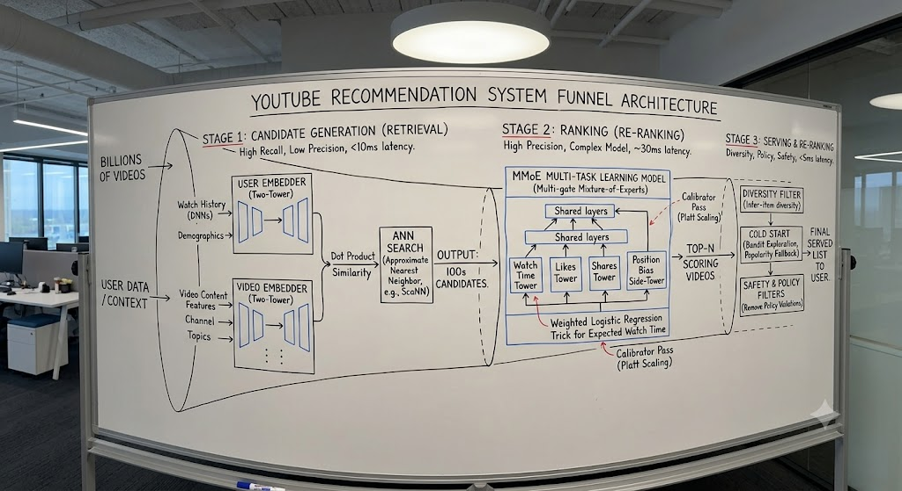
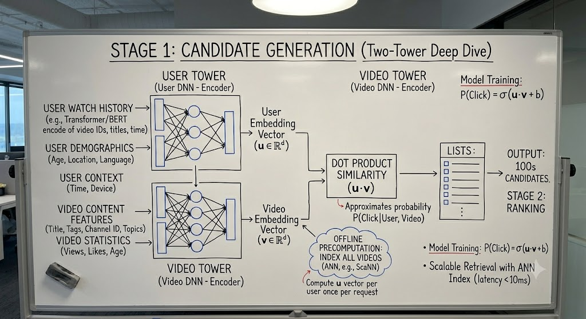
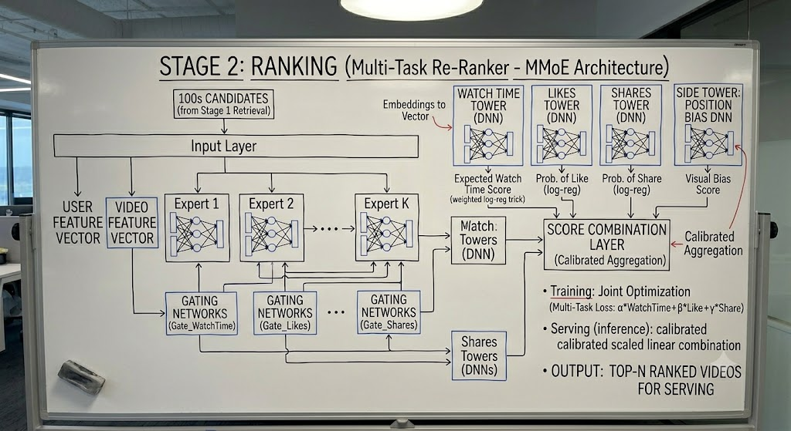
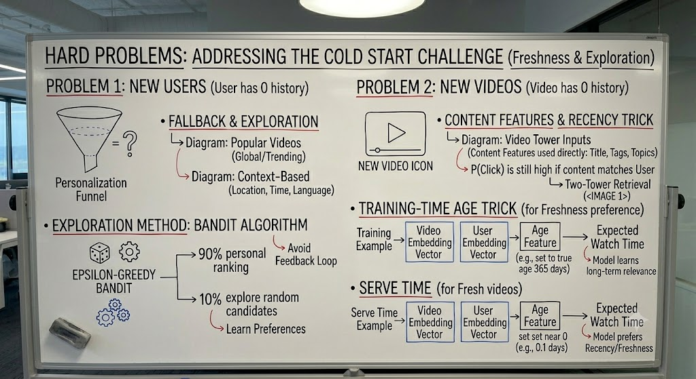

## Q1) Design a YouTube Video Recommendation System? (Homepage and optimization for engagement)

- First - Which surface are we talking about? The homepage feed and the watch next sidebar behave pretty differently, since watch next leens heavily on the video you are currently watching. And second, what are we actually optimizing for *(Push them toward long-term user satisfaction / watch time, not CTR as clickbait optimizes CTR and hurts retention)*? Because that choice drives the whole design.
- So homepage recommendations, and I am going to push back gently on "engagement". I'd optimize for long-term watch time and satisfaction rather than raw click through. If we optimize for pure CTR then we just learn to serve clickbait, which spikes short term clicks but hurts retention. So my north-star is expected watch time with guardrails on user satisfaction signals. Is this framing correct for the question?
- The Single most important constraint here is scale. We have got on the order of billions of videos and we  need to return recommendations in tens of milliseconds. That immediately rules out scoring the whole corpus with a heavy model per request. So my whole architecture is going to be a funnel: a cheap, high-recall retrieval stage that takes billions of videos down to maybe a few hundred, and then an expensive, high-precision ranking stage on top of that. Let me walk through the flow and then go deep wherever you would like.
- Starting with candidate generation, The goal here is recall and speed not precision. I dont want one source, I want several blended together: subsriptions, co-watch signals, trending, and more importand a learned retrieval model. The workhouse is a two tower model, One encode the user - their history, context, demographics and other encodes the video. I train them so the dot product of the two embeddings predicts engagement.  The best part is I can embed every video offline and build an ANN index something like ScaNN. Then at serve time I embed the user once and do an ANN lookup, which is how i can hit the latency budget. ONe thing I would be careful about here is negative sampleing. I would use in batch negatives plus some hard negatives because if i only sample easy negatives and model never learns fine distinction.
- I am using two towers and not one model because a single cross-feature model would force me to score every candidate against the user at request time, which doesn't scale to billions. The two-tower split is specifically what lets me precompute video embeddings and push the heavy lifting offline. I pay for that with a little accuracy, since the towers can't interact until the final dot product but that's exactly the tradeoff condidate generation is supposed to make. I will recover the accuracy in the ranking stage.
- Now, moving to ranking, i am only looking at a few hundred condidates, so I can afford a much richer model. Here I bring in cross features between user and video, the watch-history sequence, video age, language match and so on. I would frame this as multi task learning. I am not just predicting one number , I'm predicting watch time, likes , shares and negative signals like "not interested" jointly. A clean way to do that is a MOE setup, MMoE, so the tasks share representation without stepping on each other. Then I combine those heads into a single expected-value score for ranking.
- Two things I'd call out in ranking that interviewers usually like. One is position bias: a video that got clicked might just have been at the top, so I'd add a shallow side-tower that models position explicitly, which frees the main model to learn actual relevance. The other is that for the watch-time objective specifically, weighted logistic regression where positives are weighted by watch time is a clean trick.
- After ranking there's a re-ranking pass for the things a pure relevance model won't give me: diversity so I'm not showing ten near-identical videos, freshness, filtering out already watched content and policy and safety filters.
- For evaluation, offline i'd track recall@k for retrieval and NDCG or AUC for ranking , but those only get me a candidate worth shipping, the real decision is an online A/B test on watch time and retention, with guardrail metrics so I don't quietly hurt the user experience.
- And the last thing I'd want to flag is the hard problems. Code Start: new videos are actually handled okay by the two tower model because the video tower uses content features, but new users i'd fall back to popularity and context, and i'd add some exploration, a bandit or epsilon-greedy so fresh content and new users actually get impressions. That also helps with the feeback-loop problem whre the system just reinforces whatever it already shows. And for freshness specifically, ther ea neat trick which is feeding the age of each training example as a feature, then setting it near zero at serve time, so the model learns recency preference instead of being biased towerd older videos that have has more time to accumulate watches.

### Follow-up questions (deep dives the interviewer will push on)

**Q: How exactly do you train the two-tower retrieval model, and where do labels come from?**
It's trained as a retrieval/contrastive problem, not a pointwise classifier. A positive is a (user, video) pair where the user actually engaged, where I define "engaged" as a meaningful watch (e.g. watched past some fraction or some seconds), not just a click, so I don't bake clickbait into retrieval. The loss is sampled softmax / in-batch softmax: for each positive, the other videos in the batch act as negatives, and I maximize the dot product of the matching pair relative to those negatives. Labels are entirely implicit feedback logged from production. The one subtlety is the **sampled-softmax correction**: popular videos appear as in-batch negatives far too often, so I apply a logQ correction (subtract the log sampling probability) to avoid over-penalizing head content.

**Q: You mentioned in-batch plus hard negatives. Why not just in-batch negatives?**
In-batch negatives are almost all trivially easy (a random video the user would never watch), so the model learns coarse topic separation but not fine distinctions, e.g. between two similar cooking videos. Hard negatives (items that are semantically close but were not engaged with, or impressed-but-skipped) force the model to learn the fine boundary that actually matters at retrieval time. The risk is going too hard: if every negative is brutally hard, training gets unstable and you can teach the model the wrong thing, so I'd mix a small fraction of hard negatives in with the easy ones.

**Q: Why MMoE for ranking instead of just training a separate model per objective?**
Separate models are clean but expensive: you pay N times the serving cost and N times the maintenance, and you can't share signal across tasks. A shared-bottom network shares everything, which is cheap but causes negative transfer when objectives conflict (watch-time vs. "not interested" pull representations in opposite directions). MMoE is the middle ground: a set of shared expert networks plus a per-task gating network, so each task learns its own soft combination of experts. Tasks share what's useful and specialize where they conflict, and it's still a single forward pass.

**Q: How do you collapse the multiple prediction heads into one ranking score?**
I combine them into a single expected-value score, something like a weighted product/sum of the calibrated heads, e.g. `score = P(watch) · E[watch_time] · (1 + w₁·P(like) + w₂·P(share)) − w₃·P(not_interested)`. The weights are not learned by the model; they're a product decision tuned via online A/B tests because they encode the trade-off between time-spent and satisfaction. Keeping them as explicit knobs is what lets the product team re-balance (e.g. push satisfaction harder) without retraining.

**Q: Why does the predicted-watch-time trick use weighted logistic regression?**
I want to predict expected watch time but train with a clean classification setup. So I train logistic regression on impressions where positives (clicked/watched) are weighted by their observed watch time and negatives by 1. The learned odds of that weighted classifier approximate `E[watch_time]`, so at serving I exponentiate the logit (`e^logit`) to recover an expected-watch-time estimate. This sidesteps the messy regression on a heavily skewed, zero-inflated watch-time target.

**Q: Position bias keeps coming up. How does the side-tower actually fix it?**
The training data is biased: an item got clicked partly *because* it was shown at position 1, not purely because it was relevant. If I ignore that, the model learns "things at the top are good." So I add a shallow tower that takes position (and device/context) as input and predicts the bias component, added to the main relevance logit during training. The main tower is then forced to explain the *residual*, meaning actual relevance. At serving time I drop the position tower (or set position to a constant/0), so I rank on debiased relevance only.

**Q: Recommendations create feedback loops where the model only learns from what it already showed. How do you break that?**
Two levers. First, **exploration**: I don't serve purely greedy top-K; I inject exploration via epsilon-greedy or, better, a contextual bandit (Thompson sampling / UCB) so under-shown items and new users actually get impressions and generate training data. Second, **logging the propensity**: I log the score/probability with which each item was shown so I can do inverse-propensity weighting in training and offline evaluation, which corrects for the fact that the logging policy is non-uniform. Without these, the system just amplifies its own past decisions and popularity bias compounds.

**Q: Walk through cold start more concretely. New video vs new user.**
New *video* is the easier case: the two-tower video tower is content-based (title, thumbnail, audio/visual embeddings, channel, topic), so it gets a reasonable embedding from day one without any watch history, which is a deliberate reason to keep the video tower content-driven. New *user* is harder because the user tower has almost no history, so I fall back to context (geo, language, device, time) and popularity priors, then lean on exploration to learn their taste fast. I'd also use any onboarding signals (topics they picked, first few watches) to warm up the embedding quickly.

**Q: What's the "example age" freshness trick and why does it work?**
Models trained on logged data are biased toward older videos simply because older videos have had more time to accumulate watches. The fix is to feed the **age of the training example** (how old the video was when that impression happened) as an input feature. The model learns the real shape of how engagement decays/peaks with age. Then at serving I set that feature to zero (or near-zero), which effectively asks the model "predict engagement as if this just came out," removing the staleness bias and favoring fresh content.

**Q: Your offline metric improved but the online A/B test was flat or negative. What happened?**
This is the classic offline/online gap, and there are a few usual suspects. (1) **Metric mismatch**: I optimized AUC/NDCG but the business cares about long-term retention, which a one-shot offline metric can't capture. (2) **Feedback-loop / distribution shift**: offline eval replays the old logging policy's distribution; the new model shifts what gets shown, so offline gains don't transfer. (3) **Position/selection bias** in the offline set inflating numbers. (4) **Novelty/primacy effects** in the experiment. The takeaway I'd state explicitly: offline metrics gate *what's worth testing*, but the A/B test on watch time + retention with guardrails is the real decision, and I'd run it long enough to see retention, not just day-1 clicks.

**Q: How do you keep the system fresh in production? Walk me through the retraining and re-indexing cadence.**
Two separate clocks. The ranking model is retrained frequently (often daily or continuously / incrementally) because user interest and trends drift fast. The retrieval embeddings + ANN index also need rebuilding, and there's a subtle consistency trap: if I update the video tower but serve stale user embeddings (or vice-versa), the dot products are meaningless. So user and video towers must be versioned together, and the ANN index rebuilt whenever the video tower changes. For brand-new videos in the gap between index rebuilds, I rely on the non-learned candidate sources (trending, subscriptions) so fresh uploads aren't invisible.

**Q: How do you ensure diversity in the final re-ranking pass?**
A pure relevance sort produces ten near-identical videos, which kills the session. I'd do diversity-aware re-ranking on the top candidates, using something like MMR (maximal marginal relevance) or a DPP (determinantal point process) that explicitly rewards picking items that are dissimilar from what's already in the slate. The objective becomes relevance minus a redundancy penalty over embeddings/topics. This sits *after* ranking because it's a slate-level concern: it depends on the whole result set, not a single item's score.

**Q: Predicted probabilities need to be calibrated. Why does that matter here, and how do you do it?**
Because I'm *combining* heads (P(watch), P(like), etc.) into one score, the heads must be on a comparable, true-probability scale. If P(watch) is systematically inflated, it dominates the blend for the wrong reasons. Calibration also matters anywhere a raw probability is used downstream (e.g. expected-value blending or bidding-style logic). I'd check it with reliability diagrams / ECE and fix miscalibration with Platt scaling or isotonic regression on a held-out set, and watch it over time since calibration drifts with distribution shift.
