This is the whole answer, written the way I would actually give it out loud: scope the problem for a few minutes, draw the funnel, then go as deep as the interviewer wants on any one stage. I have written down the numbers I would say, the maths I would derive on the board, and the follow-up questions I expect, because in a 45-minute loop the difference between a hire and a no-hire is almost never the architecture - everyone draws the same boxes. It is whether you can defend each box with a number and know where it breaks.

---

## Q) Design a YouTube video recommendation system

Before anything else, how I'd budget the time. I say this out loud at the start, because it tells the interviewer I know where the meat is and it gives them a clean place to interrupt me.

| Minutes | What I'm doing | What I want them to walk away with |
| --- | --- | --- |
| 0–5 | Scope, objective, constraints, back-of-envelope | I optimise long-term satisfaction, not clicks, and I know the scale |
| 5–8 | Draw the funnel end to end | The architecture falls out of the latency budget, not out of taste |
| 8–22 | Candidate generation | Two-tower, sampled softmax, ANN - and why each one is forced |
| 22–36 | Ranking | Multi-task MMoE, watch-time head, position bias, calibration |
| 36–41 | Re-ranking, serving, freshness | I think about the slate and the feedback loop, not just one item |
| 41–45 | Evaluation, failure modes, what I'd build first | I know how I'd find out I was wrong |

## Minutes 0–5: pin the problem down before touching a model

Three questions, and I genuinely need the answers because each one changes the design.

**Which surface?** The homepage feed and the watch-next sidebar are different problems. Watch-next leans almost entirely on the video you are currently watching - the seed item is the strongest feature you will ever have, and a co-watch graph gets you most of the way there. The homepage has no seed. It has to construct intent from history alone. I'm going to assume homepage, because it's the harder one and it's where the funnel actually matters.

**What are we optimising?** This is the one I care most about, and I'll push back gently if the answer is "engagement." If I optimise raw click-through, I will learn to serve clickbait - that is not a risk, it is the guaranteed optimum of that objective. A thumbnail with a shocked face and a red arrow wins every CTR auction. It spikes clicks for a month and quietly destroys the reason people open the app. So my north star is **long-term user satisfaction**, which I proxy with:

- **expected watch time** as the main positive signal, but measured as meaningful watch, not a click that bounced at three seconds;
- **explicit satisfaction** - likes, saves, subscribes, survey responses where we have them;
- **explicit dissatisfaction as a first-class term** - "not interested", "don't recommend this channel", reports. This one matters more than people expect, because it is the only signal that is unambiguous. A watch could mean anything; "don't show me this" means exactly one thing.

Clicks are an input to the model. They are never the target.

**What's the scale, and what's the latency budget?** Order of magnitude: a corpus around $10^9$ videos, a couple of billion users, and the homepage has to come back in about 200 ms end to end. Let me convert that into requests per second, because that number drives everything downstream:

```
2×10^9 users × ~5 app opens/day ≈ 10^10 requests/day
10^10 / 86,400 s                ≈ 1.2×10^5 QPS average
peak is a few times average     ≈ 3×10^5 QPS
```

So: a few hundred thousand requests a second, a corpus of a billion, and 200 ms. Those three numbers together already rule out almost every design. That's the part I want to establish before I draw a single box.

## The shape of the answer, and why it isn't a choice

Here is the argument I'd make first, because it makes the rest of the design feel inevitable rather than arbitrary.

Suppose I have a good ranking model. It's a few dense layers over a feature vector a couple of thousand dimensions wide, and batched on an accelerator it costs roughly 50 µs per candidate. Now ask what happens if I point it at the whole corpus:

```
10^9 candidates × 50 µs ≈ 50,000 seconds per request
```

Fourteen hours. Per request. That is not a tuning problem or a "throw more machines at it" problem - it is nine orders of magnitude off, and no amount of hardware closes a gap that size. So the expensive model can never see the whole corpus. Something cheap has to go first and make the set small enough for something expensive to be legal. That is the entire justification for the funnel, and I'd say it in exactly those terms.

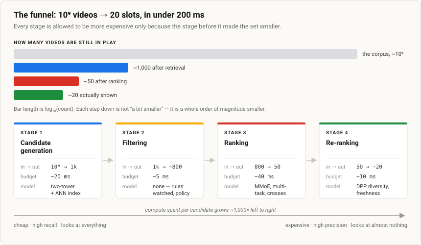

Notice what each stage is optimising. Retrieval is graded on **recall** - if the video the user would have loved isn't in the thousand, no amount of ranking brilliance recovers it, and that failure is invisible in every downstream metric. Ranking is graded on **precision and ordering**. Re-ranking isn't graded on individual items at all; it's graded on the slate as a whole.

And the candidate counts aren't round numbers I picked because they look nice. They fall out of the budget:

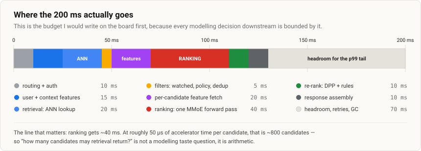

Working backwards from that bar: ranking gets ~40 ms, one candidate costs ~50 µs, so ranking can afford roughly 800 of them. That's the number retrieval has to hit. If someone asks "why not 10,000 candidates?", the answer isn't philosophical - it's that 10,000 × 50 µs is 500 ms and we've blown the budget by 2.5×. You'd have to either buy a cheaper ranker or a bigger budget, and both are real options I'd be happy to discuss.

## Stage 1 - Candidate generation

The job here is recall and speed. Not precision - I am explicitly happy to hand ranking a lot of mediocre candidates, as long as the good ones are in there.

### Blend several sources, don't pick one

I would never run this off a single retriever, because each source fails differently and the failures don't overlap:

- **Subscriptions and follows** - high precision, narrow, and a filter bubble if used alone.
- **Co-watch / item-to-item** - "people who watched this also watched that," computed offline over the co-occurrence graph. Very strong, and it covers a different kind of similarity than any embedding model does.
- **Trending, globally and per region** - this is the path that lets a major event reach everyone within minutes, including people whose learned taste would never surface it.
- **Fresh uploads from channels you watch** - this exists specifically so new videos are not invisible during the window between index rebuilds.
- **Learned retrieval** - the two-tower model. This is the workhorse and where most of the personalised recall comes from.

Each source returns a few hundred, and I union and dedupe them into ~1,000. Having the non-learned sources there is not a hedge, it's a correctness requirement: they are the only reason a video uploaded four minutes ago can be recommended at all.

### The two-tower model

One tower encodes the user, the other encodes the video, and they meet exactly once - at a dot product.

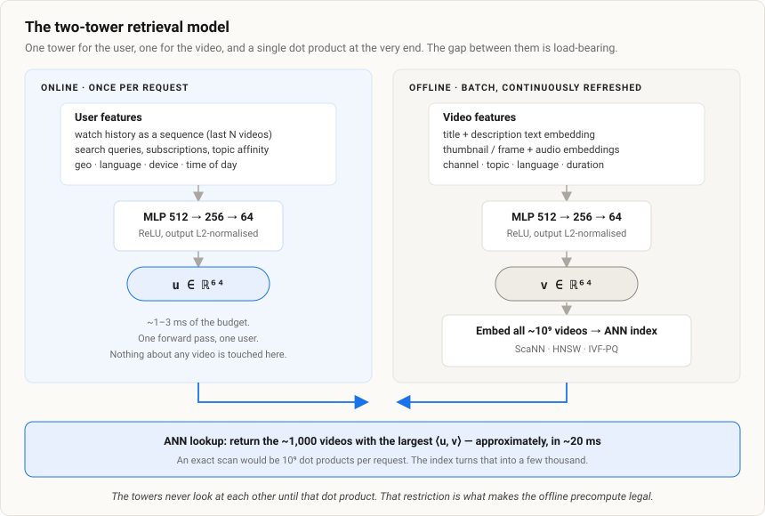

$$\text{score}(u, v) = \langle E_u, E_v \rangle$$

That single restriction - no interaction until the dot product - is what buys me everything. Because the video tower never sees the user, I can run it offline over all $10^9$ videos, store the resulting vectors, and index them. At request time I compute one user vector and do one lookup. If I let the two sides interact anywhere earlier (a cross-attention, a concatenation, anything), I'd have to recompute every video's representation for every user, and I'm back to fourteen hours.

I'd say this out loud, because it's the actual answer to "why two towers instead of one model?": **the towers aren't separated for accuracy, they're separated for precomputability.** I lose some accuracy - real user×video interactions genuinely help - and I accept that loss on purpose, because ranking will recover it on the shortlist.

A detail worth mentioning: I keep the **video tower content-based**. Title and description text embedding, thumbnail and frame embeddings, audio, channel, topic. Not just a lookup on the video ID. If the tower is purely an ID embedding, a video uploaded this morning has a randomly initialised vector and is effectively unrecommendable until it accumulates watches - which it can't do, because it isn't being recommended. Content features break that circle on day one.

### What the loss actually is

This is not a pointwise "did they click, yes or no" classifier. Retrieval's job is to pick a needle out of $10^9$, so I train it as exactly that: a classification problem over the whole corpus, approximated by the batch.

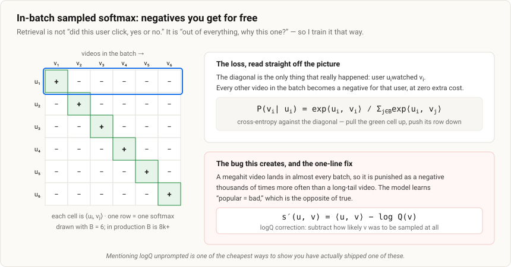

Take a batch $B$ of pairs that really happened. For each user, the video they actually watched is the positive; every other video in the batch is a negative:

$$P(v_i \mid u_i) = \frac{\exp\!\big(\langle E_{u_i}, E_{v_i}\rangle / \tau\big)}{\sum_{j \in B} \exp\!\big(\langle E_{u_i}, E_{v_j}\rangle / \tau\big)}$$

and the loss is the cross-entropy of that against the diagonal:

$$\mathcal{L} = -\frac{1}{|B|}\sum_{i \in B} \log P(v_i \mid u_i)$$

Three things I'd flag without being asked, because each one is a place I've seen this go wrong.

**The temperature $\tau$ is not decoration.** It controls how hard the softmax pushes on the nearest negatives. Too high and the embedding space stays mushy and everything is vaguely similar to everything; too low and training destabilises because a single hard negative dominates the gradient. It's one of the two or three hyperparameters actually worth sweeping.

**The label has to be a meaningful watch, not a click.** If a positive is "clicked", I have baked clickbait into the retrieval layer, and no amount of careful ranking downstream fixes a candidate set that is already 30% bait. I'd define positive as something like "watched past 30 seconds, or past some fraction of the video, whichever is more forgiving for short content."

**The logQ correction.** In-batch negatives are sampled proportional to how often a video appears in the log, so a megahit appears as a negative in nearly every batch while a long-tail video appears in almost none. The model learns to push popular items down - the exact opposite of true. The fix is to subtract the log sampling probability from the logit:

$$s'(u,v) = \langle E_u, E_v \rangle - \log Q(v)$$

where $Q(v)$ is estimated with a streaming frequency counter over the training stream. It's one line of code and it's the single most common bug in home-grown two-tower systems. Saying "logQ" unprompted is one of the cheapest credibility signals available in this interview.

### Why in-batch negatives alone aren't enough

In-batch negatives are essentially free, but they are almost all trivially easy - for a user who watches woodworking videos, a random negative is a K-pop video, and separating those two is a problem the model solves in the first thousand steps. After that it learns nothing, because the gradient is ~0 on easy negatives.

What actually matters at serving time is the fine distinction: this cooking video versus that cooking video. So I mix in **hard negatives** - items that are semantically close but weren't engaged with, and impressed-but-skipped items from the logs, which are the most honest hard negatives available because the system already thought they were good and the user disagreed.

The failure mode in the other direction is real too. If every negative is brutally hard, a lot of them are actually false negatives - videos the user would have loved and simply never saw - and you spend the whole run teaching the model that good recommendations are bad. So: mostly in-batch, a small fraction hard. Something like 5–20% is where I'd start, and I'd treat it as a tuned parameter rather than a principle.

### Serving it: what "ANN" is actually doing

At serving time I have one user vector and $10^9$ video vectors, and about 20 ms. An exact scan is $10^9$ dot products, which is off by roughly four orders of magnitude. So I use an approximate index, and I think it's worth being able to explain *how* it's approximate rather than just naming FAISS or ScaNN.

There are two independent tricks, and IVF-PQ is just both of them bolted together.

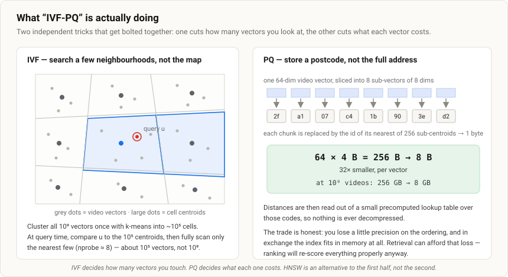

**IVF (inverted file)** cuts down *how many* vectors you touch. Cluster the corpus once with k-means into, say, $10^5$ cells. Every vector belongs to the cell of its nearest centroid. At query time, compare the user vector against the $10^5$ centroids, take the nearest `nprobe` cells, and scan only those:

```
centroid comparisons        10^5
vectors per cell            10^9 / 10^5 = 10^4
nprobe = 8 → vectors scanned 8 × 10^4
total                       ~1.8×10^5 dot products, not 10^9
```

About 5,000× less work. The failure mode is honest and worth stating: if the true nearest neighbour sits just across a cell boundary from the query, you miss it. That's exactly what `nprobe` buys back - it's a recall/latency dial, and I'd tune it against a recall@k curve rather than guess.

**PQ (product quantisation)** cuts down *what each vector costs*. Split the 64-dim vector into 8 sub-vectors of 8 dims each, and replace each sub-vector with the id of its nearest of 256 sub-centroids. One byte per chunk:

```
raw:        64 dims × 4 bytes = 256 bytes/vector → 10^9 × 256 B = 256 GB
quantised:  8 bytes/vector                       → 10^9 ×   8 B =   8 GB
```

That 32× is the difference between an index that needs a rack and one that fits in memory on a handful of machines. Distances are then read out of a small precomputed lookup table over the codes, so nothing is ever decompressed. You lose a bit of ordering precision, which is fine - this is retrieval, and ranking is about to re-score everything properly anyway.

**HNSW** is an alternative to the first half, not the second. It's a navigable small-world graph with a skip-list structure on top:

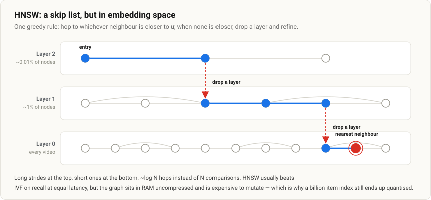

The rule at every step is greedy: hop to whichever neighbour is closer to the query, and when no neighbour is closer, drop a layer and refine. Roughly $O(\log N)$ hops instead of $O(N)$ comparisons. HNSW generally gives better recall than IVF at equal latency, and I'd reach for it first at a few hundred million vectors. At $10^9$ the graph's memory (uncompressed vectors plus edge lists) and its cost to mutate start to hurt, which is why production systems at that scale end up quantised anyway - ScaNN is essentially the industrial answer to this, combining a learned partitioning with an anisotropic quantisation that is tuned for preserving *inner products* rather than Euclidean distance, which is the right objective when your score is a dot product.

**Sharding.** One machine doesn't hold this. I'd shard the index by video across N replicasets, scatter the query to all shards, take each shard's top-k, and merge. Latency is set by the slowest shard, so I'd hedge - send to a second replica if the first hasn't answered by p95 - which is a standard trick and costs a few percent extra load to cut the tail substantially.

### Cold start, from the retrieval side

**New video** is the easy case, and it's the payoff for keeping the video tower content-based: title, thumbnail, audio, channel, topic all exist the moment it uploads, so it gets a sensible embedding immediately. It still needs to physically get into the index, which is where the nearline path matters - incremental upserts every few minutes, plus the non-learned sources (subscriptions, trending) covering the gap.

**New user** is genuinely harder, because the user tower has almost nothing to encode. I'd fall back to context - geo, language, device, time of day - plus popularity priors, use any onboarding signals (topics they picked, their first two watches), and lean on exploration to learn fast. The first session is worth an outsized amount of exploration budget, because the information gain per impression is enormous when the prior is flat.

## Stage 2 - Ranking

Now I'm down to a few hundred candidates and I can afford to be expensive. Before I describe the model, I want to put the real numbers on the table, because they're what justify every choice that follows - and interviewers at this level notice when you can't.

**Throughput.** At ~$3\times10^5$ QPS peak and ~800 candidates each:

```
3×10^5 requests/s × 800 candidates ≈ 2.4×10^8 scorings/second
```

Each scoring is a few dense layers over a wide feature vector, call it low-single-digit MFLOPs, so the aggregate sits in the **PFLOP/s** range. This is why "just add one more layer" is a recurring hardware cost, not a free accuracy win, and why the whole thing runs on a sharded accelerator fleet.

**Memory, which is not where people expect.** It isn't the network weights, it's the embedding tables:

```
10^9 videos × 64 dims × 4 bytes ≈ 2.5×10^11 bytes ≈ 250 GB
```

…for video IDs alone, before user IDs, channels, or any other high-cardinality categorical. That doesn't fit on one host, so embedding tables get **sharded across parameter servers** and looked up by ID, while the comparatively tiny dense network is replicated everywhere. Knowing that the embeddings are what blow up is what tells you where this system is actually hard to operate.

**Training data.** Every page logs ~20 impressions. At $10^5$ QPS that's on the order of $10^6$–$10^7$ impressions per second, so hundreds of billions of rows a day. I don't train on that raw. Positives are a small fraction of impressions, so I **downsample negatives hard** and keep the rare positives - which both balances the labels and gets the training set down to a few billion examples a day. If I downsample negatives, I have to correct the resulting bias in the predicted probabilities before I use them as probabilities, which matters a lot once I start multiplying heads together.

### Features: the thing retrieval structurally couldn't do

Because I'm down to hundreds, I can finally compute **cross features** between the user and each specific video. This is the whole point of the stage. Concretely:

- the watch-history sequence, run through a small transformer or just pooled;
- the candidate's content embeddings (text, thumbnail, audio);
- explicit user × video crosses - what fraction of this channel has this user finished, how many videos from this topic did they watch this week, have they watched this creator in the last month;
- language and geo match, device, time of day, whether they're on TV or mobile;
- the video's age, and its recent engagement velocity;
- position, which gets special handling - see below.

Concatenate all of that and the input is genuinely wide, which is exactly why the per-candidate cost is non-trivial and ties back to the FLOP number above.

### Multi-task, because "good" isn't one number

I don't predict one thing. I jointly predict expected watch time, $P(\text{like})$, $P(\text{share})$, $P(\text{complete})$, $P(\text{subscribe})$, and the negative signals $P(\text{not interested})$ and $P(\text{report})$.

The naive way to do that is one shared trunk with several heads. It's cheap, and it works right up until two objectives disagree - which they do constantly here. Watch time and "not interested" pull the representation in genuinely opposite directions, and a shared trunk has to pick a compromise. That's **negative transfer**, and it usually shows up as "we added the satisfaction head and watch time regressed."

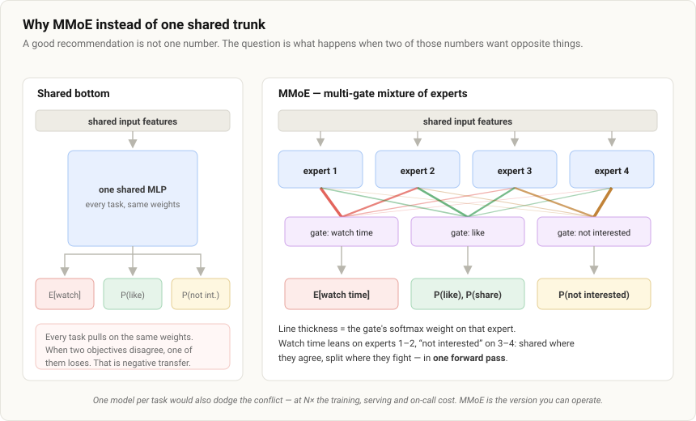

**MMoE** sits between the two extremes. A pool of expert sub-networks is shared across all tasks, and each task gets its own small gating network that learns a softmax over those experts:

$$y_k = h_k\Big(\sum_{i=1}^{n} g_k(x)_i \, f_i(x)\Big), \qquad g_k(x) = \mathrm{softmax}(W_k x)$$

So task $k$ learns *its own soft mixture* of the same experts. Where two tasks want the same features they converge on the same experts and share statistical strength; where they conflict their gates diverge and they stop stepping on each other. And crucially it's still **one forward pass** - which, at $2.4\times10^8$ scorings a second, is not a detail.

The obvious alternative - one model per objective - also solves the conflict, and I'd say so rather than pretending MMoE is the only option. It costs N× the training, N× the serving, N× the on-call surface, and you lose all cross-task signal. MMoE is the version you can actually operate.

### The watch-time head

Watch time is a nasty regression target. Most impressions have a watch time of exactly zero, so the distribution is spike-at-zero plus a long right tail, and an MSE loss on that mostly learns to predict something near zero while being dominated by a handful of six-hour outliers.

The trick I like is **weighted logistic regression**, and I'd derive it rather than assert it, because the derivation is short and it's the kind of thing that separates "I read the paper" from "I understand the paper."

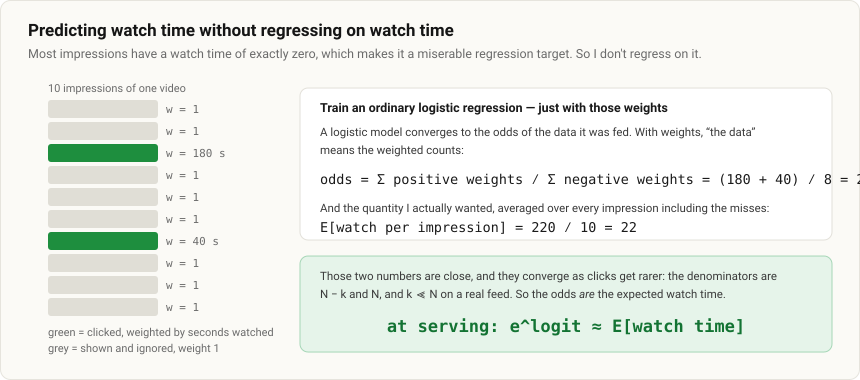

Train an ordinary logistic classifier on impressions, but weight each positive by its observed watch time $T_i$ and each negative by 1. A logistic model converges to the odds of the data it was shown, and with weights that means the *weighted* counts. For a bucket of $N$ impressions with $k$ clicks:

$$\text{odds} = \frac{\sum_{i=1}^{k} T_i}{N - k}$$

Now, clicks are rare on a feed, so $k \ll N$ and $N - k \approx N$, which gives:

$$\text{odds} \approx \frac{\sum_i T_i}{N} = \mathbb{E}[\text{watch time per impression}]$$

So at serving I take $e^{\text{logit}}$ and read it as expected watch time. Clean classification loss during training, continuous watch-time-shaped output at inference, no regression on a zero-inflated target. The place it degrades is exactly where the approximation does - a surface where clicks are *not* rare, where $N-k \not\approx N$ - and that's the honest caveat to mention.

### Position bias, and why ignoring it is self-reinforcing

My labels are contaminated before the model sees them. An item at slot 1 was clicked partly *because* it was at slot 1. Train on that naively and the model learns "things at the top are good," which is circular - it was at the top because yesterday's model liked it. And because today's model trains on today's logs, the bias compounds every retrain.

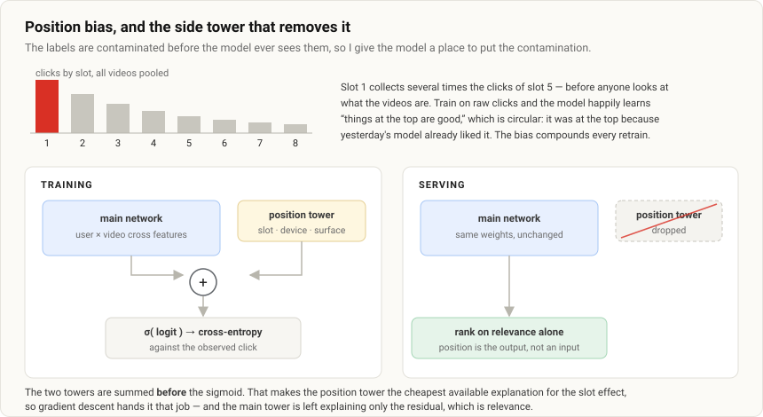

The fix is a shallow **side tower** that takes position, device, and surface, and whose output is **added to the main logit before the sigmoid**:

$$P(\text{click}) = \sigma\big(f_{\text{relevance}}(u, v) + g_{\text{position}}(p, \text{device})\big)$$

The reason this works is worth stating precisely, because "we add a position tower" without the reason is a memorised answer. Since the two terms are summed before the non-linearity, the position tower is the *cheapest available explanation* for any variance that correlates with slot, so gradient descent assigns that job to it. The main tower is then left explaining only the residual - which is relevance. At serving there is no position yet (position is the *output* of ranking, not an input), so I drop the tower or pin it to a constant, and rank on the debiased term alone.

### Collapsing the heads into one number

Ranking has to produce one ordering, so the heads get folded into a single expected-value score:

$$\text{score} = P(\text{watch}) \cdot \mathbb{E}[\text{watch time}] \cdot \big(1 + w_1 P(\text{like}) + w_2 P(\text{share})\big) - w_3 P(\text{not interested})$$

Two things about this, and both are the point rather than footnotes.

**The weights are not learned.** They are product knobs, tuned by online A/B test, because they encode a business trade-off - how much is a "like" worth in seconds? - that no offline loss can settle. Keeping them explicit is what lets the team push toward satisfaction without retraining the stack. If an interviewer asks how I'd pick them, the honest answer is: start from an equivalence the product team can reason about ("we'll treat a share as worth 60 seconds"), then move it and read the guardrails.

**Calibration is load-bearing here.** The moment I multiply heads together, they have to be on a true probability scale. If $P(\text{watch})$ runs systematically 20% high, it silently dominates the product and I've changed the ranking without changing any weight. So I monitor calibration with reliability diagrams and expected calibration error, correct with Platt scaling or isotonic regression on a held-out set, and re-check it after every retrain - miscalibration drifts with distribution shift, and negative downsampling introduces it deliberately, so this is not a one-time fix.

## Stage 3 - Re-ranking, where the slate becomes the unit

Everything so far scored videos independently. But the user doesn't consume one video, they consume a page - and the best page is not the top 20 items by score. Ten near-identical videos can each be individually excellent and collectively terrible. This stage is where I stop optimising items and start optimising the set.

### Diversity via DPP

The manual approach is category caps: "at most 3 from any topic." It works, it's easy to explain, and it's brittle - the caps need constant hand-tuning, and topic labels are a coarse proxy for what "similar" actually means. A determinantal point process gives you the same effect from a principle instead of a rulebook.

Build a kernel $L$ over the shortlist that carries both quality and similarity:

$$L = \mathrm{diag}(q)\, S \,\mathrm{diag}(q)$$

where $q_i$ is item $i$'s relevance from the ranker and $S_{ij}$ is the cosine similarity between video embeddings. Then the probability of selecting a set $S$ is proportional to a determinant:

$$P(S) \propto \det(L_S)$$

And a determinant is a *volume* - the volume of the parallelepiped spanned by the item vectors. That single fact is the whole intuition:

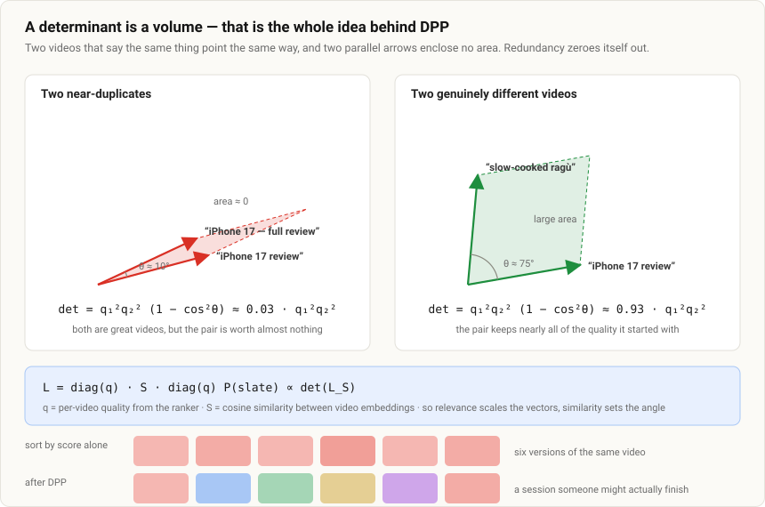

For two items you can write the determinant out completely, and it's beautiful:

$$\det(L_{\{1,2\}}) = q_1^2 q_2^2 \big(1 - s_{12}^2\big)$$

Quality enters squared, similarity subtracts. Two brilliant near-duplicates ($s_{12} \to 1$) give a determinant near zero no matter how good they individually are. Two merely-good but unrelated videos keep nearly all their quality. Nobody wrote a rule about categories; it falls out of the geometry.

Exact MAP inference over subsets is NP-hard, so in practice it's the **greedy** version: repeatedly add the item that maximises the marginal gain $\log\det(L_{S \cup i}) - \log\det(L_S)$, which geometrically is the squared distance from item $i$ to the span of what you've already picked. With an incremental Cholesky update that's $O(k^2 N)$, and at $N=50$, $k=20$ it's microseconds - completely free inside a 10 ms budget.

**MMR versus DPP**, since interviewers like to ask. Maximal marginal relevance is the cheaper cousin:

$$\text{MMR}: \ \arg\max_{i \notin S} \Big[\lambda\, q_i - (1-\lambda)\max_{j \in S} s_{ij}\Big]$$

| | MMR | DPP (greedy) |
| --- | --- | --- |
| What it penalises | similarity to the **single** closest chosen item | the volume of the **whole** chosen set |
| Catches "3 items that are pairwise okay but all lie in one plane" | no | yes |
| Cost | $O(kN)$, trivial | $O(k^2N)$, still trivial at these sizes |
| Tuning | one $\lambda$ | a kernel, plus how you scale $q$ |
| When I'd use it | first version, or if the shortlist is huge | once diversity is a metric someone owns |

I'd ship MMR on day one and move to DPP when diversity becomes a number someone is accountable for. Saying that - rather than reaching straight for the fanciest option - usually goes down well.

### Freshness, and the example-age trick

Left alone, any model trained on logged data prefers old videos, for a reason that has nothing to do with quality: an old video has had months to accumulate watches, while one uploaded this morning has had hours. Nothing in the feature vector says *when* the impression happened, so the model reads "old" as "good."

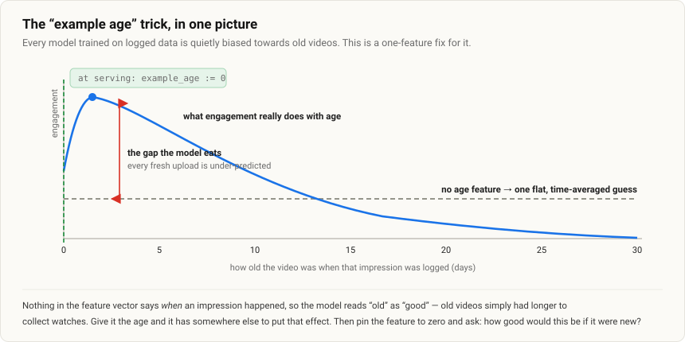

The fix is one feature: the **age of the video at the moment that training example was logged**. Now the model has somewhere to put the effect, and it learns the real shape of how engagement rises and decays with age. Then at serving I set that feature to zero and effectively ask: *how good would this be if it had just come out?* The staleness bias disappears, and it's a genuinely elegant trick - one feature, no architecture change, no extra loss term.

On top of that I'd apply an explicit freshness boost in re-ranking, and I'd be clear that it's a product decision rather than a modelling one. The reason isn't user satisfaction on this request, it's supply: creators need early impressions to get any signal at all, and a platform that starves new uploads dies slowly from the supply side, long before the demand-side metrics notice.

### The rest of the re-ranking pass

- **Already-watched and dedup**, including near-duplicate detection by embedding distance - the same video re-uploaded by three channels should occupy one slot, not three.
- **Policy and safety filters**, applied as a hard gate rather than a score penalty. Anything that must never be shown must not depend on a threshold that a model can drift past.
- **Creator concentration caps** - at most k videos from one channel in a slate, which is partly a diversity concern and partly an ecosystem one.
- **Format mix**, e.g. long-form versus Shorts, which is usually an explicit product target rather than something the model should be allowed to decide.

## The serving system

Here's the whole thing as I'd draw it, with the online path on the right and the artifact each stage reads from on the left.

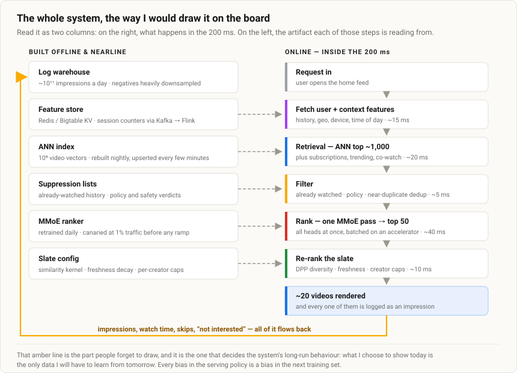

**The feature store is two systems, not one,** and conflating them is a classic mistake:

- **Static and slow-moving features** - video metadata, channel stats, long-run user profiles - live in a key-value store (Redis, Bigtable) and are refreshed by batch jobs. Read path has to be single-digit milliseconds at $10^5$ QPS × hundreds of candidates, so this is a serious piece of infrastructure in its own right.
- **Real-time features** - what has this user watched in the last five minutes, what have they skipped in this session, what's this video's engagement velocity in the last hour - are maintained by stream processing. Events land on Kafka, Flink maintains windowed aggregates and session state, and it writes into the same store the serving path reads. Seconds of freshness, not hours. This matters more than it sounds: in-session signal is often the strongest feature you have, because it's the only evidence of what the user wants *right now* rather than what they wanted last month.

**Train/serve skew is the failure I'd worry about most,** because it's silent. If training features are recomputed from the warehouse but serving features come from Redis, any discrepancy - a different null-handling rule, a counter that was backfilled, a feature that was updated between the impression and the batch job - degrades the model in a way that shows up as "offline looked great, online was flat" and takes weeks to find. The fix is **feature logging**: log the exact feature vector that was used to score, at scoring time, and train on that. It costs storage and it's worth every byte, because it makes point-in-time correctness a property of the system rather than a thing you have to be careful about.

**Two separate clocks for refreshing.** The ranker retrains daily or continuously, because interest and trends drift fast. The retrieval towers retrain less often, but there's a consistency trap worth calling out: **the two towers must be versioned together.** If I deploy a new user tower while the index still holds vectors from the old video tower, the dot products are between vectors in two different spaces - they're meaningless, and nothing crashes. It degrades quietly. So: tower versions are pinned to index versions, the index is rebuilt whenever the video tower changes, and rollout is atomic per version.

## Evaluation

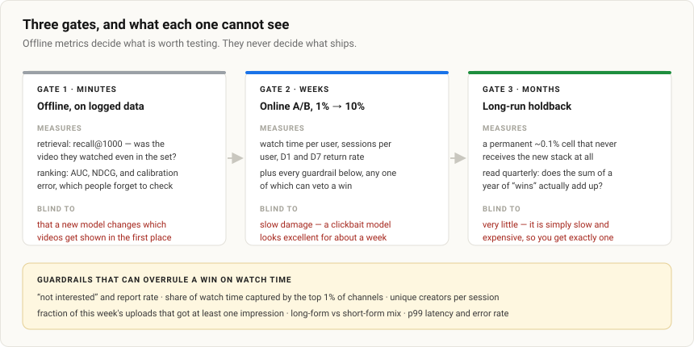

**Offline, per stage, because the stages have different jobs.** Retrieval is graded on **recall@k** - of the videos the user actually watched, how many were in our top 1,000? That's the only metric that catches the funnel's worst failure, which is a great video never entering the set. Ranking is graded on **NDCG** and **AUC** for ordering, and on **calibration error** for the heads, since I'm multiplying them together.

**Online is what decides.** A/B test at 1%, then 10%, and read watch time per user, sessions per user, and D1/D7 return rate. I'd run it long enough to see retention rather than day-1 clicks, because the failure mode I'm most afraid of - clickbait - looks like a win for about a week. Guardrails can veto: "not interested" rate, report rate, share of watch time concentrated in the top 1% of channels, fraction of this week's uploads that got at least one impression, unique creators per session, and p99 latency.

**When offline improves and online doesn't** - which happens constantly - the usual suspects, in the order I'd check them:

1. **Metric mismatch.** AUC went up, long-term satisfaction didn't. The offline metric was never measuring the thing we care about.
2. **Distribution shift from the policy change.** Offline replay evaluates against the *old* logging policy's distribution. A new model shifts what gets shown, so the gain doesn't transfer. This is the big one, and it's why I'd log propensities and use inverse-propensity weighting for offline evaluation.
3. **Position and selection bias** inflating the offline number.
4. **Novelty effects** in the experiment - any visible change gets a temporary bump that decays.

## The hard parts

These are the questions I'd want to raise myself if the interviewer hasn't, because volunteering them signals you've operated one of these rather than just designed one.

**The feedback loop is the deepest problem in the system.** The model only ever learns from what it chose to show. Anything it doesn't show generates no data, so it stays unshown - the system is training on its own output, forever. Two levers. First, **exploration**: don't serve purely greedy top-k. Epsilon-greedy is the simple version; a contextual bandit with Thompson sampling is the better one, because it explores in proportion to uncertainty rather than uniformly, which is much cheaper in lost watch time. Second, **log the propensity** - the probability with which each item was shown - so training and offline evaluation can be inverse-propensity weighted to correct for a non-uniform logging policy. Without both, popularity bias compounds every single retrain and the catalogue effectively shrinks.

**Popularity bias is the same disease with a different name.** Head content gets more impressions, generates more positives, gets embedded more sharply, and gets recommended more. logQ helps in retrieval, IPS helps in training, and the trending/exploration sources help at serving - but I'd also just *measure* it, with the share of watch time going to the top 1% of channels as a standing guardrail.

**Filter bubbles are a slate-level and a temporal problem.** DPP handles the within-slate version. The across-time version - the user's feed narrowing month over month - isn't visible in any single request, so I'd track it explicitly as unique topics per user per week and treat a decline as a regression even if watch time is up.

**The clickbait objective is not hypothetical.** Anything trained on clicks converges on it. My defences are: define positives as meaningful watches, put the negative-feedback heads directly in the ranking score with real weight, and keep survey-based satisfaction in the guardrails so there's at least one metric that cannot be gamed by the thumbnail.

**Where I'd expect this to break first in practice.** Not the models - the feature pipeline. A Flink job falling behind and serving stale session features, or a schema change that silently changes a feature's meaning between training and serving. It doesn't page anyone, it just makes recommendations quietly worse. I'd monitor feature distributions in production against the training distribution and alert on divergence, which in my experience catches more real regressions than model metrics do.

**Where the field is heading, if there's time.** The direction I find most interesting is replacing the ID-plus-ANN retrieval stack with **semantic IDs** - quantising each item's content embedding into a short sequence of discrete tokens with something like an RQ-VAE - and then doing **generative retrieval**, where a transformer decodes the tokens of the next item directly instead of doing a nearest-neighbour lookup. Two things about it appeal to me: semantically similar items share token prefixes, so cold-start generalisation is structural rather than bolted on, and the retrieval step stops being a separate index you have to keep consistent with your model. It's not obviously a win at $10^9$ items yet - decoding is slower than an ANN probe, and the index-consistency problem is replaced by a decoding-latency problem - but it's the first idea in a while that changes the shape of the funnel rather than improving a box inside it.

## Follow-up questions I'd expect

**Q: How exactly do you train the two-tower model, and where do the labels come from?**
As a contrastive retrieval problem, not a pointwise classifier. A positive is a (user, video) pair where the user genuinely engaged, defined as a meaningful watch rather than a click, so clickbait doesn't get baked into retrieval. The loss is in-batch sampled softmax: for each positive, the other videos in the batch act as negatives, and I maximise the matching pair's dot product relative to them. All labels are implicit feedback logged from production - nobody hand-labels anything. The subtlety is the logQ correction: popular videos appear as in-batch negatives far too often, so I subtract $\log Q(v)$ to stop the model learning that popularity is bad.

**Q: Why two towers instead of one model that sees the user and video together?**
Purely for precomputability. A cross-feature model would have to score every candidate against the user at request time, which doesn't work over $10^9$ items. Keeping the towers apart until the final dot product is what lets me embed every video offline and build an ANN index. I do pay for it in accuracy, because the towers can't interact - and that's precisely the trade retrieval is supposed to make. Ranking is where I buy the accuracy back on a shortlist of a few hundred.

**Q: Why MMoE rather than one model per objective?**
Separate models are clean but cost N× training, N× serving, N× maintenance, and share no signal across tasks. A shared-bottom network shares everything, which is cheap but causes negative transfer when objectives conflict - and watch-time versus "not interested" conflict constantly. MMoE is the middle: shared experts, a per-task gate that learns its own soft mixture, so tasks share what's useful and specialise where they fight. And it stays one forward pass, which at $10^8$ scorings a second is a hard requirement rather than a nicety.

**Q: How do you turn several prediction heads into one ranking score?**
A weighted expected-value combination, roughly $P(\text{watch}) \cdot \mathbb{E}[\text{watch}] \cdot (1 + w_1 P(\text{like}) + w_2 P(\text{share})) - w_3 P(\text{not interested})$. The weights are deliberately not learned - they encode a product trade-off between time-spent and satisfaction that no offline loss can resolve, and keeping them as explicit knobs is what lets the product team re-balance without retraining. The precondition is that the heads are calibrated, because the moment you multiply them, a systematically inflated head silently dominates.

**Q: Why does the watch-time head use weighted logistic regression?**
Because watch time is a horrible regression target - mostly zeros with a long tail - and I want a clean classification loss. So I weight positives by observed watch time and negatives by 1. The learned odds are then $\sum T_i / (N-k)$, and since clicks are rare ($k \ll N$) that's approximately $\sum T_i / N$, which is expected watch time per impression. At serving I exponentiate the logit to recover it. The approximation is only as good as "$k \ll N$", which is worth stating.

**Q: Position bias - why does a side tower actually fix it?**
Because the two logits are summed before the sigmoid, the position tower becomes the cheapest way for the network to explain any variance that tracks slot, so gradient descent hands it that job. The main tower is left with the residual, which is relevance. At serving I drop the tower or pin position to a constant, so ranking uses debiased relevance. If I didn't do this, the model would learn "position 1 is good", which is circular - it was at position 1 because the previous model liked it - and the bias would compound every retrain.

**Q: How do you break the feedback loop?**
Exploration plus propensity logging. Exploration so under-shown items and new users actually get impressions and generate data - epsilon-greedy as the simple version, a contextual bandit with Thompson sampling as the better one, because it spends its exploration budget where uncertainty is highest instead of uniformly. Propensity logging so I can inverse-propensity-weight both training and offline evaluation and correct for a non-uniform logging policy. Without both, the system amplifies its own past decisions and the effective catalogue shrinks over time.

**Q: Walk me through cold start more concretely - new video versus new user.**
New video is the easier one, and it's why I insist the video tower be content-based: title, thumbnail, audio, channel and topic all exist at upload, so it gets a usable embedding from minute one. The remaining problem is physical - getting it into the index - which the nearline upsert path and the trending/subscription sources cover. New user is harder because the user tower has nothing to encode, so I fall back to context and popularity priors, use onboarding signals if the product has them, and spend an outsized exploration budget on the first session, where information gain per impression is highest.

**Q: What's the example-age trick and why does it work?**
Logged data is biased towards old videos because they've had longer to accumulate watches, and nothing in the features tells the model when the impression happened - so it reads age as quality. Feeding the video's age at impression time gives the model somewhere else to attribute that effect, and it learns the real engagement-versus-age curve. Then at serving I set the feature to zero, which asks "predict engagement as if this just came out." One feature, no architecture change.

**Q: Your offline metric improved but the online A/B was flat. What happened?**
The usual four, in the order I'd check. Metric mismatch - I optimised AUC, the business wants retention. Distribution shift - offline replay scores against the old policy's distribution, and the new model changes what gets shown, so the gain doesn't transfer. Residual position or selection bias inflating the offline number. Novelty effects in the experiment. The framing I'd state explicitly: offline metrics decide *what is worth testing*, the A/B decides *what ships*, and it has to run long enough to see retention rather than day-1 clicks.

**Q: How do you keep the system fresh in production?**
Two clocks. The ranker retrains daily or continuously because interest drifts fast. The retrieval towers retrain less often, but the ANN index has to be rebuilt whenever the video tower changes - and the trap is that the user and video towers must be versioned together, because serving a new user tower against an index built by an old video tower produces meaningless dot products and fails silently rather than loudly. Between rebuilds, brand-new uploads are covered by incremental upserts plus the non-learned candidate sources.

**Q: How do you ensure diversity, concretely?**
Slate-level re-ranking on the top candidates, after ranking, because it depends on the whole result set rather than any single item's score. MMR for a first version, DPP once it matters: build $L = \mathrm{diag}(q) S \mathrm{diag}(q)$ and greedily maximise $\log\det$, which geometrically means repeatedly picking the item furthest from the span of what's already chosen. The reason I prefer DPP over category caps is that caps need endless hand-tuning and topic labels are a coarse proxy for similarity, whereas the determinant gets it from the embedding geometry directly.

**Q: Why does calibration matter here specifically?**
Because I combine heads multiplicatively. If $P(\text{watch})$ runs systematically high, it dominates the product for reasons that have nothing to do with the videos, and I've changed the ranking without changing a single weight. It also matters because I downsample negatives during training, which deliberately breaks calibration and has to be corrected. I'd check with reliability diagrams and ECE, fix with Platt or isotonic scaling on held-out data, and re-check after every retrain, since calibration drifts with distribution shift.

**Q: If you had one quarter and a small team, what would you build first?**
Popularity and subscription-based candidates with a gradient-boosted ranker on a handful of features, plus the logging and A/B infrastructure. Not because it's the best system, but because the logs are the prerequisite for everything else - the two-tower model cannot be trained without them, and a team that builds the fancy model before the logging pipeline spends its second quarter discovering its labels are wrong. Then two-tower retrieval, then multi-task ranking, then diversity. In that order, and I'd expect the biggest single metric jump to come from the ranker rather than the retriever.

## If I had two minutes left

The summary I'd give: it's a funnel, and it's a funnel because $10^9 \times 50\,\mu s$ is fourteen hours. Retrieval is cheap and graded on recall, and the two-tower split exists to make offline precompute legal rather than to be accurate. Ranking is expensive and multi-task, because a good recommendation is several numbers that disagree with each other. Re-ranking is where the slate becomes the unit and diversity stops being a rule and becomes geometry. And the thing I'd want to be remembered for saying is that the logging loop is part of the architecture: what I show today is the only data I get to learn from tomorrow, so every bias in the serving policy becomes a bias in the next model - which is why exploration and propensity logging are design decisions, not nice-to-haves.
